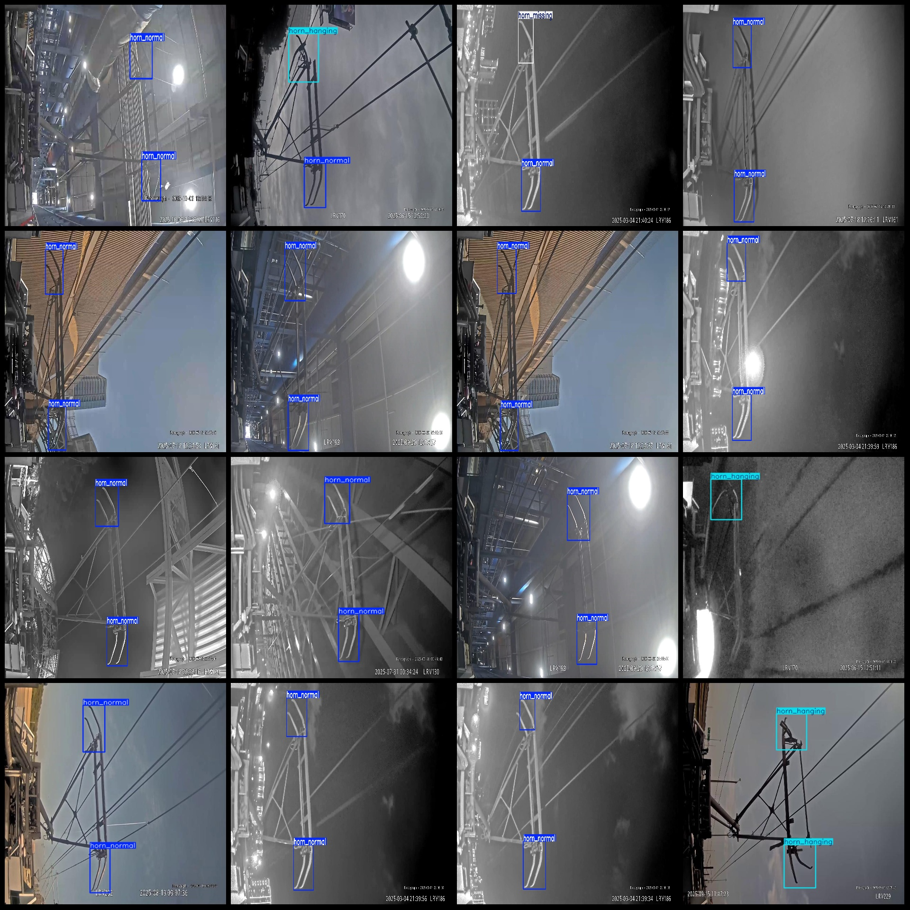

# Intelligent Railway Electrodynamic Flange Defects and State Identification Dataset in VOC+YOLO Format with 1048 Images in 3 Categories

Dataset Format: Pascal VOC format + YOLO format (txt file without split path, only containing jpg images, corresponding VOC format xml files, and YOLO format txt files)
Number of Images (jpg Files): 1048
Number of Annotations (xml Files): 1048
Number of Annotations (txt Files): 1048
Number of Annotation Categories: 3
Annotation Category Names (Note that the order of categories in the YOLO format does not correspond to this, but is based on the labels folder classes.txt): ["horn_hanging", "horn_missing", 
"horn_normal"]
Number of Boxes per Category:
- horn_hanging (Horn Hanging) = 173 boxes
- horn_missing (Horn Missing) = 168 boxes
- horn_normal (Normal Horn) = 1674 boxes
Total Boxes: 2015
Image Resolutions: Multi-resolution images, such as 640x640, 2304x1296, etc.
Used Annotation Tool: labelImg
Annotation Rules: Draw bounding boxes for each category
Important Notes: No specific notes provided at this time
Special Disclaimer: This dataset does not guarantee the accuracy of the trained models or weight files
Image Preview:
Annotation Example:

Image

Here is a pay link on Stripe ( https://buy.stripe.com/3cs8yP7sY87d0vu9AB ). Please contact me lonlonago@foxmail.com after funding $89, and I will send you a complete data files , thank you!

